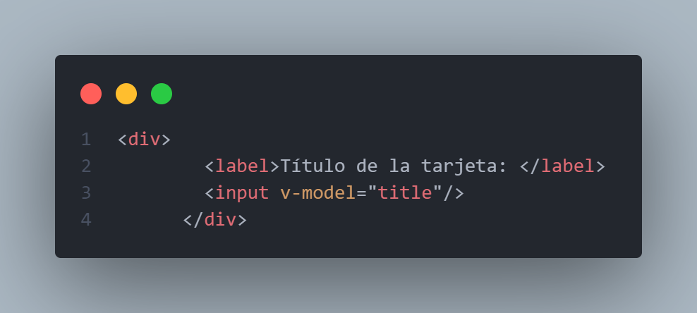
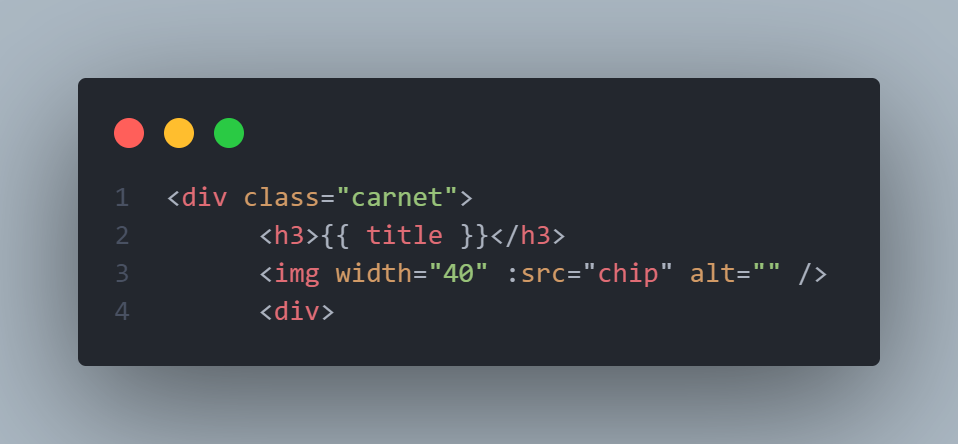
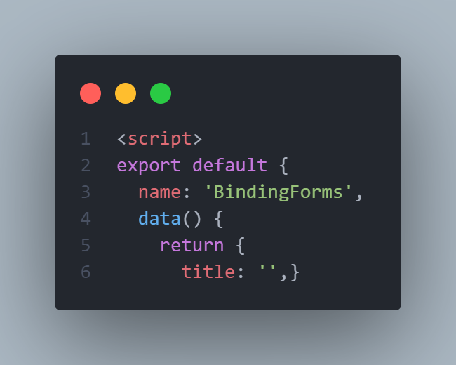
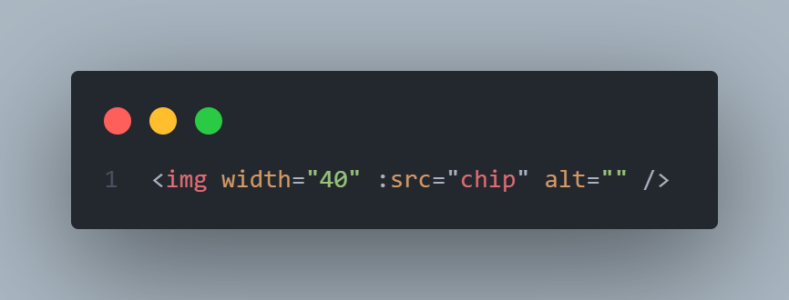

# Binding de formularios Tarjeta de crédito - Nicolás Valderrama

1.- Se enlaza el valor de los inputs con el estado de manera bidireccional usando el v-model.

2.- Se interpola en las etiquetas que correspondan las variables del estado.

3.- Se crean las variables del estado correspondiente a la información de la tarjeta.

4.- Se enlazan las rutas de las imágenes usando el binding unidireccional en el atributo src por medio del formulario.

